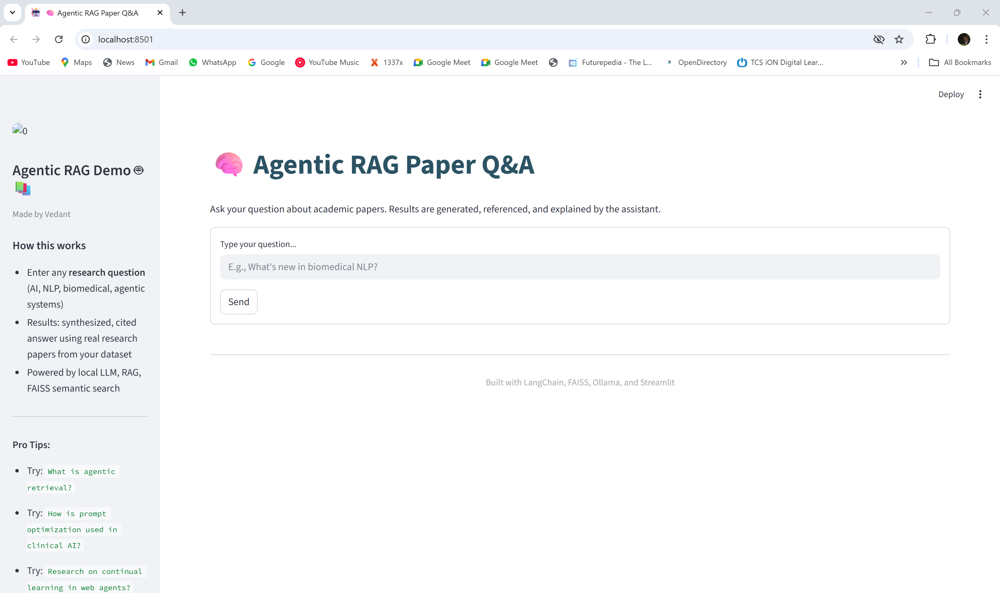
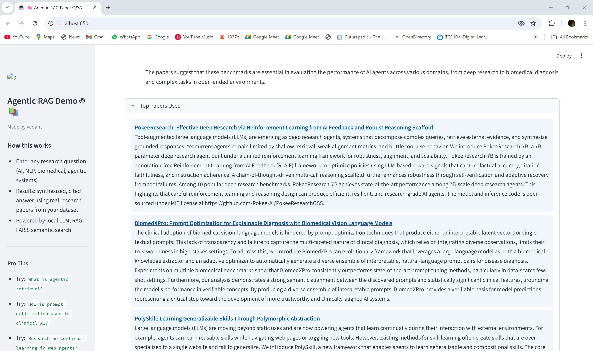

# 🧠 Agentic RAG Paper Q&A

A modern, agentic Research Assistant app that answers your questions by retrieving, citing, and synthesizing information from recent academic AI/NLP papers.  
Powered by **LangChain**, **FAISS**, **Sentence Transformers**, **Ollama (local LLMs)**, and a beautiful **Streamlit** frontend.

---

## 🏆 Features

- **Semantic Paper Retrieval:** Finds the most relevant papers using dense embeddings and FAISS vector search.
- **Agentic Answer Generation:** Synthesizes answers with a real LLM (Ollama Mistral) using retrieved paper context.
- **Citations & Summaries:** Cites specific papers by title and links in every answer.
- **Chat-Style, Modern UI:** Conversational app experience with avatars, history, sidebar tips, and theme switching.
- **Completely Local & Free:** All core models and code run locally—no paid APIs needed!

---

## 📦 Installation

Clone the repository and install dependencies:
git clone https://github.com/VedantGit7/agentic-rag-paper-qa.git
- cd agentic-rag-paper-qa
- pip install -r requirements.txt

Install [Ollama](https://ollama.com/download) for LLM-powered answers:


ollama pull mistral
ollama serve


---

## 🚀 Usage

1. Make sure your `papers.json` file contains the academic papers you want to search and cite.
2. Start the app:
    ```
    streamlit run app.py
    ```
3. Enter any research question (e.g., `What are advances in agentic retrieval?`) and interact with the chat interface.

---

## 🧩 Project Structure

agentic-rag-paper-qa/
│
├── app.py # Streamlit frontend
├── retriever_demo.py # FAISS retriever and embedding index
├── papers.json # Academic paper data file
├── requirements.txt # Python dependencies
└── README.md # This file


---

## 💡 How it Works

1. **Embed Papers:** Uses Sentence Transformers to encode paper summaries.
2. **Build Retriever:** FAISS indexes these embeddings for fast semantic search.
3. **Answer Flow:**
    - User asks a research question.
    - Retriever finds top relevant papers.
    - LLM (via Ollama) synthesizes answer, citing sources.
    - Results shown as chat bubbles and clickable paper cards.
4. **No API Needed:** The answer engine runs locally—privacy and speed!

---

## 📈 Example Questions to Try

- *What is agentic retrieval in NLP?*
- *How is prompt optimization used in clinical AI?*
- *Summarize recent research on robust reasoning agents.*
- *What methods improve RL in biomedical models?*

---

## 💻 Demo Screenshots





---

## 🤖 Tech Stack

- [Streamlit](https://streamlit.io) – UI
- [LangChain](https://langchain.com) – Agentic infrastructure
- [FAISS](https://github.com/facebookresearch/faiss) – Vector search
- [Sentence Transformers](https://www.sbert.net) – Embeddings
- [Ollama](https://ollama.com) – Local LLM for synthesis

---

## 🙏 Credits / License

- Academic paper data from arXiv.org (for demo use).
- Logo/icon: arXiv.org, Streamlit, Ollama.

Licensed under MIT.

---

## 📬 Contact/Contribute

For issues, improvements, or questions, file an Issue or reach out to [vedantwedhane@gmail.com].

*Happy researching! 🚀*
